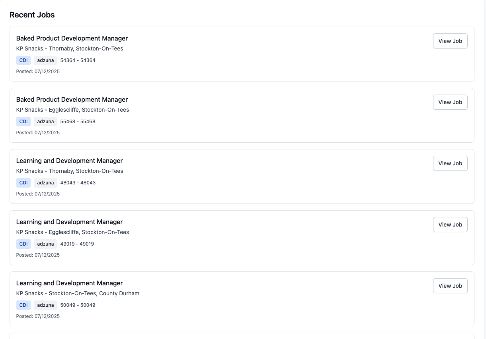

# Job Alert System

Automated job alerts with WhatsApp notifications powered by Adzuna API.


## Features

- International job search (Adzuna API)
- FREE WhatsApp notifications (Baileys)
- Job filtering by keyword, location, type
- Modern dashboard with Tailwind CSS
- RESTful API
- PM2 process management
- Queue system for background jobs

## Screenshots

### Dashboard


### Create Alert Form


### Jobs List


## Installation
```bash
git clone https://github.com/zakariafl27/laravel-job-scraper.git
cd laravel-job-scraper

composer install
cd whatsapp-service && npm install && cd ..

cp .env.example .env
php artisan key:generate
php artisan migrate
```

## Configuration

Edit `.env` file:
```env
DB_CONNECTION=pgsql
DB_DATABASE=JobScaper
DB_USERNAME=postgres
DB_PASSWORD=your_password

ADZUNA_APP_ID=your_app_id
ADZUNA_APP_KEY=your_app_key

QUEUE_CONNECTION=database
```

Get free Adzuna API keys: [developer.adzuna.com](https://developer.adzuna.com)

## Usage

**Start all services:**
```bash
pm2 start whatsapp-service/ecosystem.config.js
pm2 save
```

**Access dashboard:**
```
http://localhost:8000
```

**Create alert via API:**
```bash
curl -X POST http://localhost:8000/api/v1/alerts \
  -H "Content-Type: application/json" \
  -d '{
    "user_name": "John",
    "user_email": "john@example.com",
    "user_phone": "+212600000000",
    "keyword": "Developer",
    "location": "London",
    "sources": ["adzuna"]
  }'
```

## PM2 Commands
```bash
pm2 status              # Check services
pm2 logs                # View logs
pm2 restart all         # Restart services
pm2 stop all            # Stop services
```

## WhatsApp Setup

1. Start WhatsApp service
2. Check logs for QR code: `pm2 logs whatsapp-service`
3. Scan QR with WhatsApp on phone
4. Connection saved in `whatsapp-service/auth_info_baileys/`

## Tech Stack

- **Backend:** Laravel 11, PHP 8.3
- **Database:** PostgreSQL 15
- **Frontend:** Tailwind CSS
- **WhatsApp:** Baileys (Node.js)
- **Process Manager:** PM2
- **Job Queue:** Laravel Queue

## API Endpoints

| Method | Endpoint | Description |
|--------|----------|-------------|
| GET | `/api/v1/jobs` | List jobs (paginated) |
| GET | `/api/v1/jobs/{id}` | Get job details |
| GET | `/api/v1/jobs/statistics` | Dashboard statistics |
| GET | `/api/v1/alerts` | List all alerts |
| POST | `/api/v1/alerts` | Create new alert |
| PUT | `/api/v1/alerts/{id}` | Update alert |
| DELETE | `/api/v1/alerts/{id}` | Delete alert |

## Project Structure
```
laravel-job-scraper/
├── app/
│   ├── Http/Controllers/Api/
│   ├── Jobs/
│   ├── Models/
│   └── Services/Scrapers/
├── whatsapp-service/
│   ├── server.js
│   └── ecosystem.config.js
├── screenshots/
│   ├── dashboard.png
│   ├── alert-form.png
│   └── jobs-list.png
├── database/migrations/
├── resources/views/
└── routes/api.php
```

## Troubleshooting

**Queue not working:**
```bash
pm2 restart laravel-queue
php artisan queue:failed
php artisan queue:retry all
```

**WhatsApp disconnected:**
```bash
pm2 restart whatsapp-service
pm2 logs whatsapp-service  # Scan new QR
```

**Clear cache:**
```bash
php artisan optimize:clear
```

## Contributing

1. Fork the repository
2. Create feature branch
3. Commit changes
4. Push to branch
5. Open Pull Request

## License

MIT License

## Author

**Zakaria FLAFI**
- GitHub: [@zakariafl27](https://github.com/zakariafl27)
- LinkedIn: [Zakaria FLAFI](https://www.linkedin.com/in/zakaria-flafi-410706333/)

## Support

If you find this project helpful:
- Star the repository
- Report bugs via [Issues](https://github.com/zakariafl27/laravel-job-scraper/issues)
- Contribute improvements

---

Made in Morocco 🇲🇦
